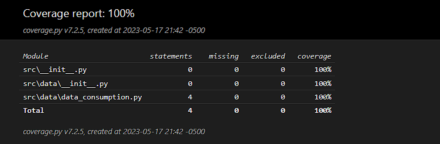

# Depression data visualization
Data visualization of depression and anxiety stats. 
## Description

Includes the visualization of data related to the following
* Depression by age
* Actual depression diagnosis
* Relation with anxiety
* Body mass index view
* Treatment stats for depression and anxiety

## Getting Started

### Dependencies

* Python 3.10.2
* Command line

### Environment setup (Windows 10)

* Open the console in the project root
* If you are going to create a local environment follow the next instructions
  * Run ```python -m venv myenv```
  * Run ```.\myenv\Scripts\activate```

### Coverage report



To replicate the coverage report, run:
* Run the tests with coverage ```python -m coverage run -m unittest discover```
* Generate the HTML report ```python -m coverage html```
* Open the report [file](htmlcov/index.html)

## Authors

Contributor names and contact info

- [alejovasquero](https://github.com/alejovasquero)

## Version History

* 1.0
    * Initial version

## License

This project is licensed under the GPL GNU License - see the [LICENSE.md](/LICENSE) file for details 